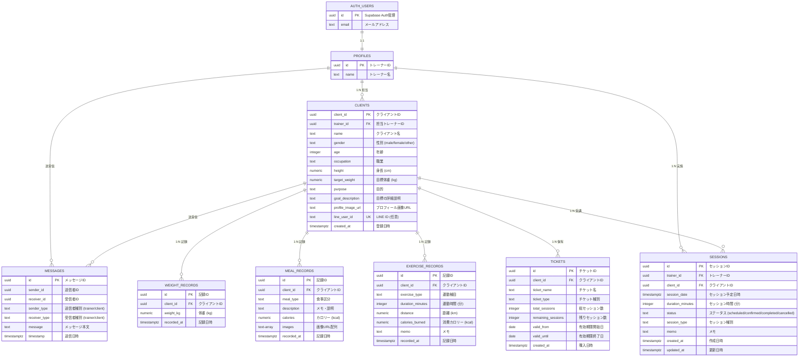

```mermaid
erDiagram
    AUTH_USERS ||--|| PROFILES : "1:1"
    PROFILES ||--o{ CLIENTS : "1:N 担当"
    PROFILES ||--o{ MESSAGES : "送受信"
    PROFILES ||--o{ SESSIONS : "1:N 実施"
    CLIENTS ||--o{ MESSAGES : "送受信"
    CLIENTS ||--o{ WEIGHT_RECORDS : "1:N 記録"
    CLIENTS ||--o{ MEAL_RECORDS : "1:N 記録"
    CLIENTS ||--o{ EXERCISE_RECORDS : "1:N 記録"
    CLIENTS ||--o{ TICKETS : "1:N 保有"
    CLIENTS ||--o{ SESSIONS : "1:N 受講"

    AUTH_USERS {
        uuid id PK "Supabase Auth管理"
        text email "メールアドレス"
    }

    PROFILES {
        uuid id PK "トレーナーID"
        text name "トレーナー名"
    }

    CLIENTS {
        uuid client_id PK "クライアントID"
        uuid trainer_id FK "担当トレーナーID"
        text name "クライアント名"
        text gender "性別 (male/female/other)"
        integer age "年齢"
        text occupation "職業"
        numeric height "身長 (cm)"
        numeric target_weight "目標体重 (kg)"
        text purpose "目的"
        text goal_description "目標の詳細説明"
        text profile_image_url "プロフィール画像URL"
        text line_user_id UK "LINE ID (任意)"
        timestamptz created_at "登録日時"
    }

    MESSAGES {
        uuid id PK "メッセージID"
        uuid sender_id "送信者ID"
        uuid receiver_id "受信者ID"
        text sender_type "送信者種別 (trainer/client)"
        text receiver_type "受信者種別 (trainer/client)"
        text message "メッセージ本文"
        timestamptz timestamp "送信日時"
    }

    SESSIONS {
        uuid id PK "セッションID"
        uuid trainer_id FK "トレーナーID"
        uuid client_id FK "クライアントID"
        timestamptz session_date "セッション予定日時"
        integer duration_minutes "セッション時間 (分)"
        text status "ステータス (scheduled/confirmed/completed/cancelled)"
        text session_type "セッション種別"
        text memo "メモ"
        timestamptz created_at "作成日時"
        timestamptz updated_at "更新日時"
    }

    WEIGHT_RECORDS {
        uuid id PK "記録ID"
        uuid client_id FK "クライアントID"
        numeric weight_kg "体重 (kg)"
        timestamptz recorded_at "記録日時"
    }

    MEAL_RECORDS {
        uuid id PK "記録ID"
        uuid client_id FK "クライアントID"
        text meal_type "食事区分"
        text description "メモ・説明"
        numeric calories "カロリー (kcal)"
        text-array images "画像URL配列"
        timestamptz recorded_at "記録日時"
    }

    EXERCISE_RECORDS {
        uuid id PK "記録ID"
        uuid client_id FK "クライアントID"
        text exercise_type "運動種目"
        integer duration_minutes "運動時間 (分)"
        numeric distance "距離 (km)"
        numeric calories_burned "消費カロリー (kcal)"
        text memo "メモ"
        timestamptz recorded_at "記録日時"
    }

    TICKETS {
        uuid id PK "チケットID"
        uuid client_id FK "クライアントID"
        text ticket_name "チケット名"
        text ticket_type "チケット種別"
        integer total_sessions "総セッション数"
        integer remaining_sessions "残りセッション数"
        date valid_from "有効期限開始日"
        date valid_until "有効期限終了日"
        timestamptz created_at "購入日時"
    }
```
