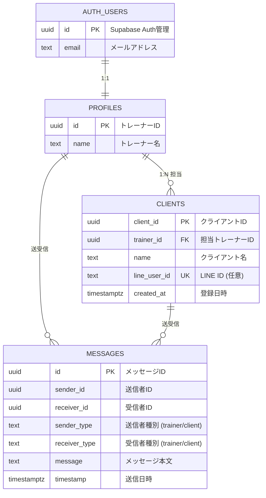

```mermaid
erDiagram
    AUTH_USERS ||--|| PROFILES : "1:1"
    PROFILES ||--o{ CLIENTS : "1:N 担当"
    PROFILES ||--o{ MESSAGES : "送受信"
    CLIENTS ||--o{ MESSAGES : "送受信"

    AUTH_USERS {
        uuid id PK "Supabase Auth管理"
        text email "メールアドレス"
    }

    PROFILES {
        uuid id PK "トレーナーID"
        text name "トレーナー名"
    }

    CLIENTS {
        uuid client_id PK "クライアントID"
        uuid trainer_id FK "担当トレーナーID"
        text name "クライアント名"
        text line_user_id UK "LINE ID (任意)"
        timestamptz created_at "登録日時"
    }

    MESSAGES {
        uuid id PK "メッセージID"
        uuid sender_id "送信者ID"
        uuid receiver_id "受信者ID"
        text sender_type "送信者種別 (trainer/client)"
        text receiver_type "受信者種別 (trainer/client)"
        text message "メッセージ本文"
        timestamptz timestamp "送信日時"
    }
```